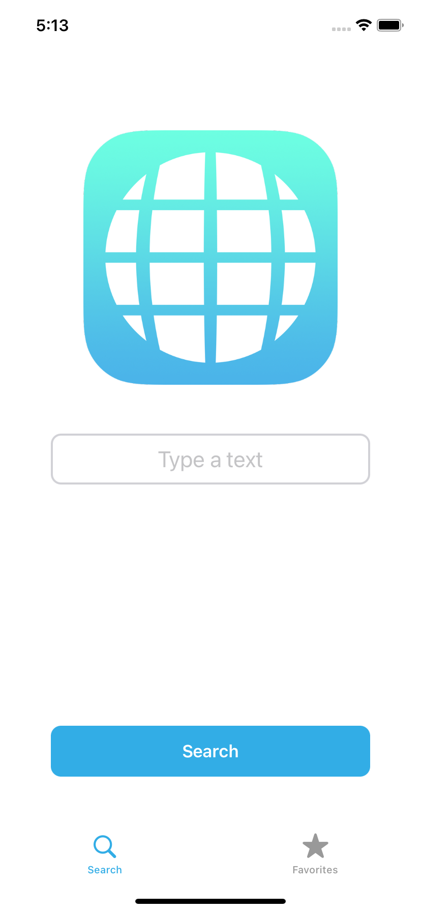
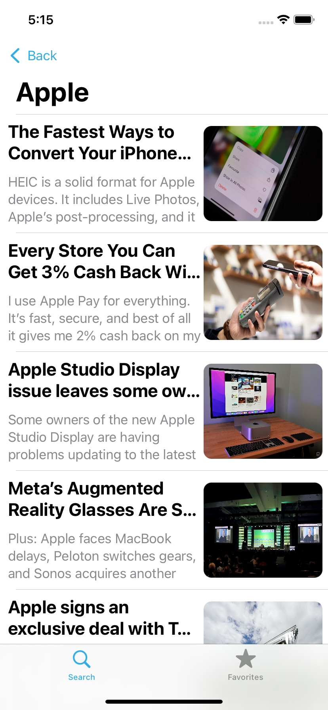
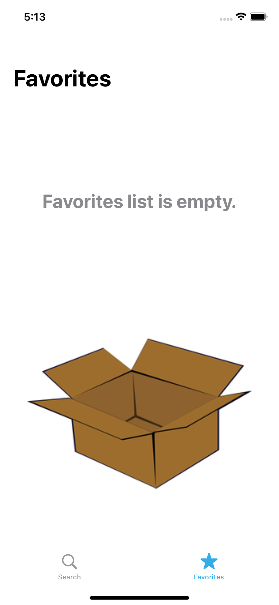
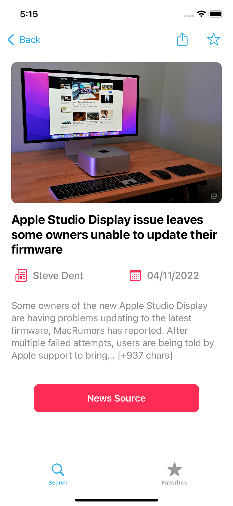
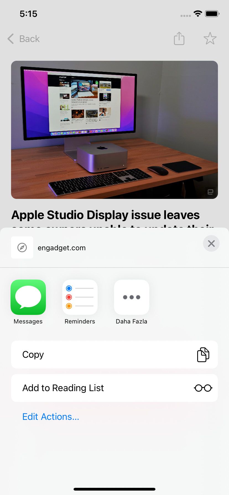
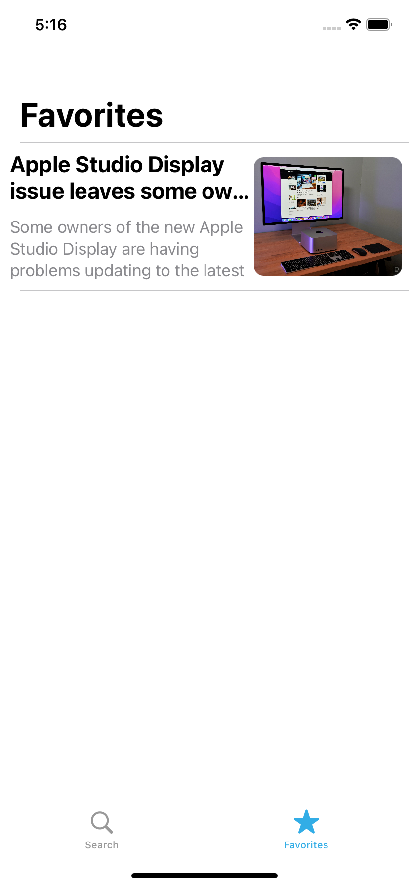
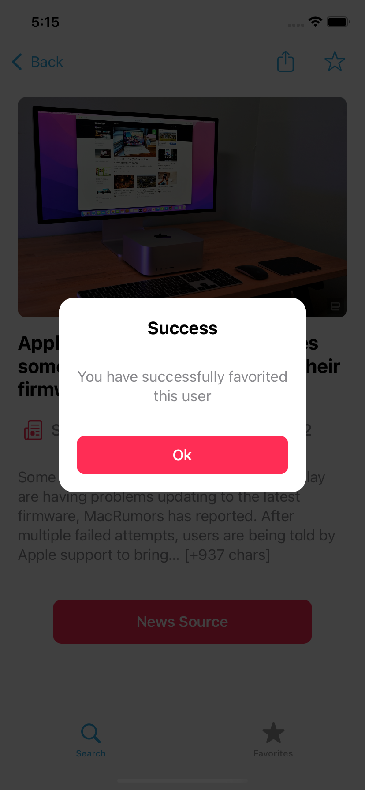
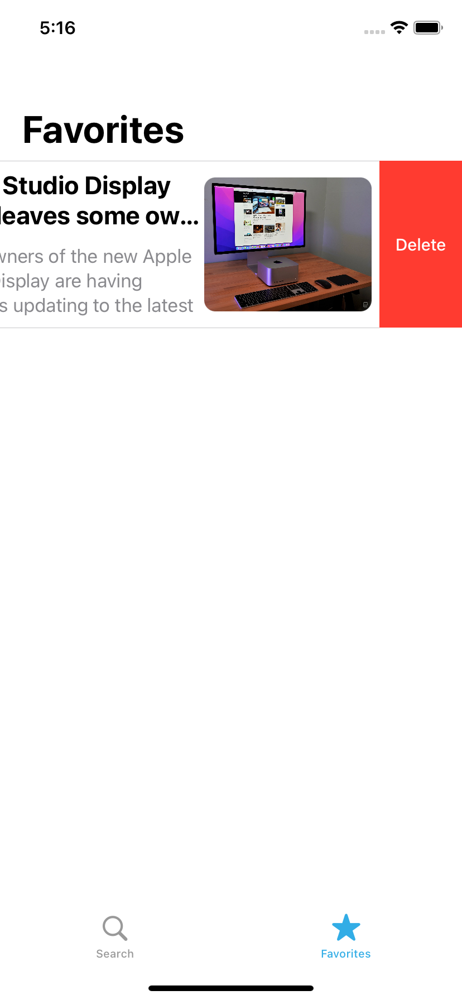
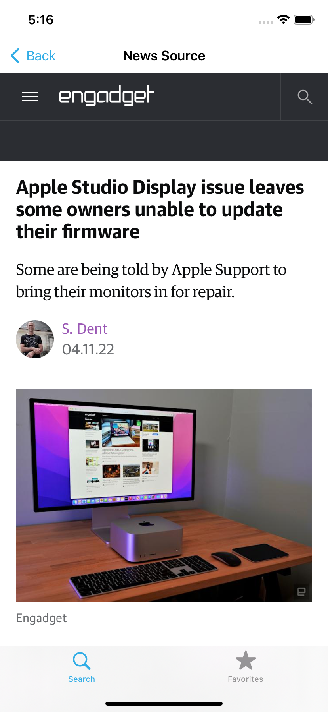

# Appcent-NewsApp-iOS
 
 NewsApp is a multifunctional news application that is built for the iOS platform.
 It is using [NewsAPI](https://newsapi.org/)
 
 ## Features
 
 * Search News
 * Show news in detail when tapped
 * View news in its source address on WebView
 * Add Favorites
 * Delete Favorites
 * Share the source of the news
 * Custom Alert Screen
 * Pagination

## Screenshots

   
   
   
